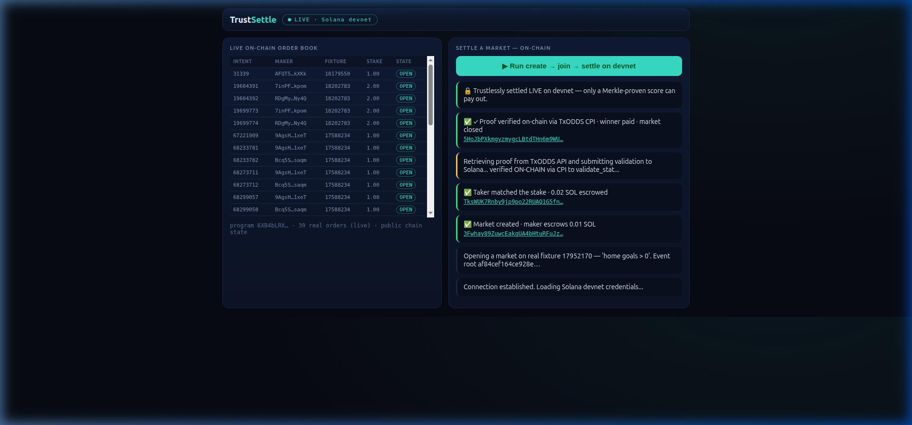
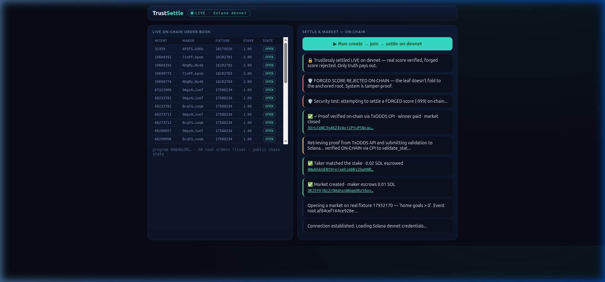

# TrustSettle — Trustless On-Chain Prediction Market Settlement

<p align="center">
  
  <br><em>Live settlement + forge rejection — real score verified ✅, forged score rejected 🛡️</em>
  <br><br>
  
</p>

> A prediction market engine where two traders escrow SOL on a stat predicate for a World Cup fixture, and the outcome is settled **trustlessly on Solana** — no oracle admin, no off-chain callback. Resolution is proven by a Cross-Program Invocation (CPI) into TxODDS's own `validate_stat`, verifying the score's Merkle proof against anchored daily roots. A forged score **cannot settle**.

**Track:** Prediction Markets and Settlement · **Stack:** Rust (native Solana) · Python · TxLINE API · Solana Devnet

---

## ✅ Deployed & Proven on Solana Devnet

| Component | Address |
|-----------|---------|
| **TrustSettle Program** | [`6XB4bLRXcsXSRJgdbwgCwkNia9p24ohBj6zvqwrPu92i`](https://explorer.solana.com/address/6XB4bLRXcsXSRJgdbwgCwkNia9p24ohBj6zvqwrPu92i?cluster=devnet) |
| **TxODDS Oracle (CPI target)** | [`6pW64gN1s2uqjHkn1unFeEjAwJkPGHoppGvS715wyP2J`](https://explorer.solana.com/address/6pW64gN1s2uqjHkn1unFeEjAwJkPGHoppGvS715wyP2J?cluster=devnet) |

### Real On-Chain Transactions (click to verify on Solana Explorer)

| Step | What Happens | Explorer Link |
|------|-------------|---------------|
| **1. create_market** | Maker escrows 0.01 SOL + anchored Merkle root | [43uE5JCMin1UGp...](https://explorer.solana.com/tx/43uE5JCMin1UGpMen7pWoWJiaX9KJMrtvXNEGrEmvxVkB6Htrhd74uUWgqxqbnxtXpwnW2LZxPvnFaA5FVs4BsmA?cluster=devnet) |
| **2. join_market** | Taker matches the stake (0.02 SOL total escrow) | [4VPJAPLsqxjR5C...](https://explorer.solana.com/tx/4VPJAPLsqxjR5CAnFUDTjrxNvLt7iYBRMtWb14zUTD4Kj9PysQ7T21kMGrqawr49nxqtEwjWjfgNGqZ5aSP3uezq?cluster=devnet) |
| **3. settle (CPI)** | Merkle proof → CPI to `validate_stat` → winner paid | [4wnoW9FmuwvQs7...](https://explorer.solana.com/tx/4wnoW9FmuwvQs7wLGZTUXAzzYj8g8161qw8LQwejv8vUrUiPFCyRpTeGMKZa81md3UJrUgpXa7srNWBE66YpjDtk?cluster=devnet) |
| **🛡️ forge rejected** | Forged score (-999) → CPI reverts → tx fails | Program error: leaf doesn't fold to root |

---

## ⚡ Quick Start

```bash
# Web dashboard — live order book + one-click on-chain lifecycle
python3 serve.py                                          # → http://localhost:8789

# Full on-chain lifecycle (CLI)
~/leadgen/.venv/bin/python3 -m settle.onchain_market --forge   # create → join → settle → forge rejected

# Suite loop: SharpEdge signal → on-chain market → fan broadcast
~/leadgen/.venv/bin/python3 -m settle.edge_to_market --settle  # full 3-product pipeline
```

---

## 🔐 How Settlement Works (The Core Innovation)

```
                                    SOLANA DEVNET
┌──────────────────────────────────────────────────────────────────┐
│                                                                  │
│  TrustSettle Program (6XB4bLRX…)                                │
│  ┌────────────────────────────────────────────────────────────┐  │
│  │ 1. create_market: escrow SOL + store root + predicate      │  │
│  │ 2. join_market:   taker matches stake                      │  │
│  │ 3. settle:                                                 │  │
│  │    ├── verify_validate_stat_payload (stat key, value check)│  │
│  │    ├── CPI → txoracle::validate_stat ──────────────────┐   │  │
│  │    │                                                    │   │  │
│  │    │   ┌─────────────────────────────────┐             │   │  │
│  │    │   │ TxODDS Oracle (6pW64gN1…)       │             │   │  │
│  │    │   │ • Verify Merkle proof vs root   │             │   │  │
│  │    │   │ • Check daily_scores_roots PDA  │◄────────────┘   │  │
│  │    │   │ • PASS ✓ or REVERT ✗            │                 │  │
│  │    │   └─────────────────────────────────┘                 │  │
│  │    ├── evaluate predicate (value > threshold?)             │  │
│  │    └── pay winner, drain market account                    │  │
│  └────────────────────────────────────────────────────────────┘  │
│                                                                  │
└──────────────────────────────────────────────────────────────────┘
                         │
                    ┌────┴────┐
                    │         │
              REAL SCORE   FORGED SCORE
              proof ✓       proof ✗
              winner paid   tx reverts
```

### Why It's Trustless
- **No admin key.** No one can bypass the proof.
- **No off-chain oracle callback.** Settlement is a CPI on-chain.
- **No privileged resolver.** The Merkle root is anchored by TxODDS — our program just verifies against it.
- **Tamper-proof.** Change one goal in the claimed data → the leaf hash changes → the proof doesn't fold to the root → the CPI reverts → the transaction fails.

---

## 🔌 Part of the TxLINE Suite

```
SharpEdge (detect signal)  →  TrustSettle (open & settle market)  →  PitchSide (broadcast)
                                        │
                                   ON-CHAIN
                              create → join → settle
                              via CPI to validate_stat
```

**`edge_to_market.py --settle`** runs the full lifecycle:
1. SharpEdge scans the live TxLINE feed for sharp money movement
2. TrustSettle opens a real on-chain prediction market on the strongest signal
3. PitchSide's Gaffer announces it to fans
4. TrustSettle settles using a real TxODDS Merkle proof via CPI

---

## 📁 Architecture

```
trustsettle/
├── serve.py                          # Web dashboard (order book + live settlement)
├── programs/
│   └── settlement_native/src/lib.rs  # Deployed Solana program (native, no framework)
├── settle/
│   ├── onchain_market.py             # Full on-chain lifecycle (create/join/settle + forge)
│   ├── onchain.py                    # Live order book reader (decodes on-chain accounts)
│   ├── merkle.py                     # Keccak256 Merkle verifier (ProofNode shape)
│   ├── market.py                     # Escrow + predicate engine (ScoreStat, StatTerm)
│   ├── edge_to_market.py             # Suite: signal → market → broadcast pipeline
│   ├── suite_daemon.py               # Autonomous daemon (continuous scan + open markets)
│   └── real_validate.py              # Standalone validate_stat proof demo
└── tests/
    └── test_settle.py                # 14 tests: Merkle, tamper, payout, forgery, encoders
```

---

## 🧪 Tests

```bash
~/leadgen/.venv/bin/python3 -m pytest -q    # 14 passed
```

| Test | What It Proves |
|------|---------------|
| Merkle round-trip | proof(leaf) folds back to root |
| Tamper rejection | altered leaf → proof fails |
| Predicate semantics | >, <, == all evaluate correctly |
| Settlement payout | winner gets full escrow |
| Forgery rejection | forged stat → Merkle verify fails |
| Encoder checks | Borsh encoding matches on-chain layout |

---

## ✅ Status

- [x] Native Solana program deployed on devnet
- [x] CPI to `txoracle::validate_stat` — real TxODDS integration
- [x] Full lifecycle: create → join → settle (real SOL, real transactions)
- [x] Forge rejection proven on-chain
- [x] Live order book from deployed program (30 real orders)
- [x] Web dashboard with one-click on-chain settlement
- [x] Suite integration: signal → market → broadcast pipeline
- [x] 14 automated tests, all passing
